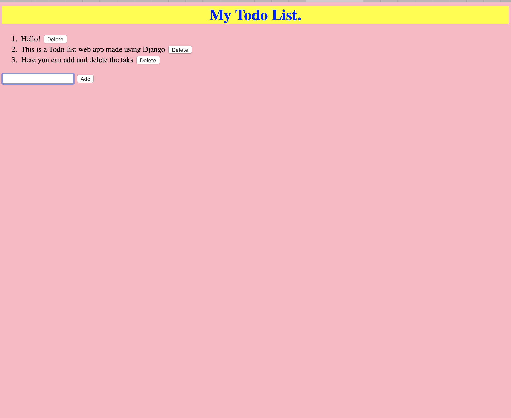

# Todo-List_WebApp
A Todo-List WebApp made using Django

# Preview of Webapp

# How to Run
### Step-1: Download all the files and folders, and store them in a folder on your local computer
### Step-2: Go to terminal and change directory to the new folder that you have created
### Step-3: Install pip
### Step-4: Install Django 2.1 using pip
Use the command: pip install Django==2.1
 
### Step-5: Create a virtual environment
Use the command: pipenv shell
 
### Step-6: Run the server to get the link
Use the command: python manage.py runserver
 
### Step-7: Obtain the link and put "/todo" at the end of it and then run it in the browser to run the WebApp

# Additional Reasources
I used this [blog](https://medium.com/fbdevclagos/how-to-build-a-todo-app-with-django-17afdc4a8f8c) to understand how to create a Webapp using Django.
